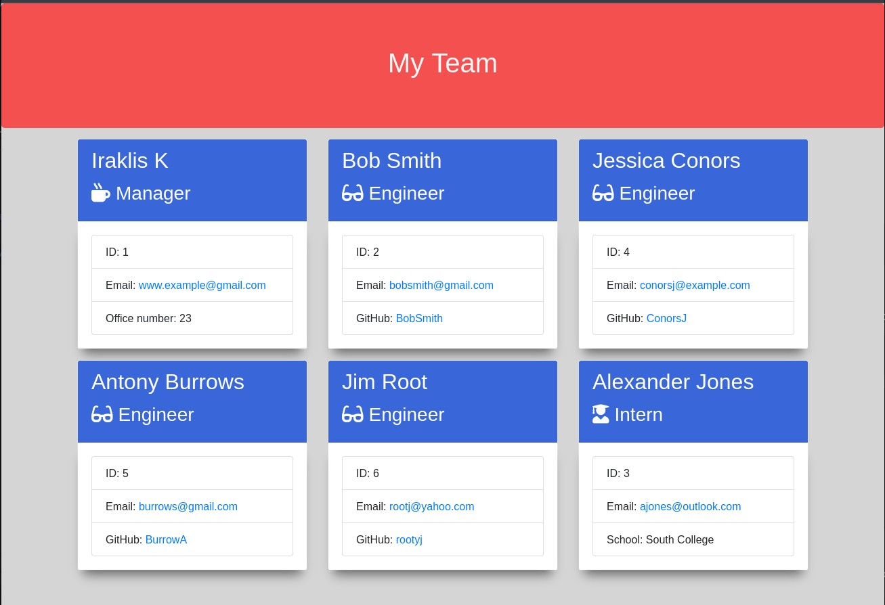

# Team Profile Generator

## Description
This is a program that generates a webpage based on the input of a Team Manager through CLI. 

The user is asked a number of questions about themselves and then about what types of team members they want to add. 

Depending on their choices, whether they want to add Engineers or Interns, details about the members of their team are asked and filled in. 
When the process is finished, a styled and mobile-first, responsive, html file is generated displaying the team with all the details entered and links to each team member's email and Github account. 

For this project, classes have been used for different types of employees and validations have been added for the user inputs through Inquirer. 


## Table of contents
- [Team Profile Generator](#team-profile-generator)
  - [Description](#description)
  - [Table of contents](#table-of-contents)
  - [Installation](#installation)
  - [Usage](#usage)
  - [Screenshots](#screenshots)
  - [Contributing](#contributing)
  - [Tests](#tests)
  - [Questions](#questions)
  - [Credits](#credits)
  - [License](#license)


## Installation 

Run the script below to install the app.
```
  npm i
```


## Usage

Open terminal and run the following to run the app.
```
  node index.js
```

[Back to Top](#team-profile-generator)

## Screenshots

Screenshots of the generated page below.

Desktop:



Tablet:


Mobile:


[Back to Top](#team-profile-generator)

## Contributing

If you want to contribute : 

[github.com/QuantumK9](https://github.com/QuantumK9)

## Tests

Run the following script for testing:
```
  npm test
```

## Questions

For any questions or requests : [github.com/QuantumK9](https://github.com/QuantumK9)

## Credits

Quantum K


## License 

MIT License

[](https://opensource.org/licenses/MIT)
  
[Back to Top](#team-profile-generator)